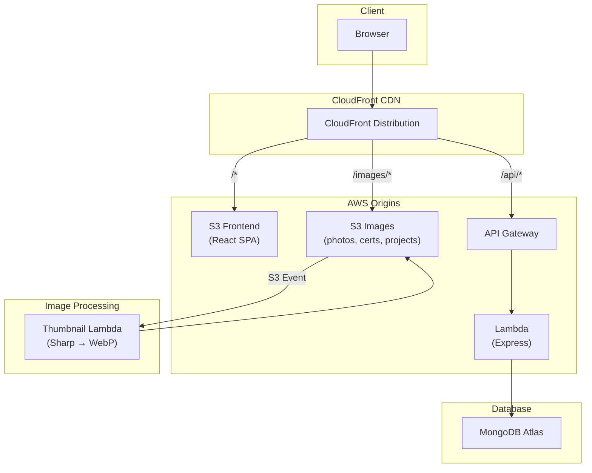

# Portfolio & Photography Gallery

A full-stack personal portfolio website with an integrated photography gallery, admin CMS, and AWS serverless deployment. Built as a monorepo with React, Express, and AWS CDK.

## Features

- **Bento Grid Homepage** -- Dynamic layout with location map (OpenStreetMap), tech stack pills, featured projects, and gallery preview
- **Project Showcase** -- GitHub projects with screenshots, live demo embeds (iframe), and detail overlays
- **Experience Timeline** -- Employment history grouped by company with highlights, education, and certificates with inline PDF viewer
- **Photography Gallery** -- Masonry grid with infinite scroll, category filtering, and thumbnail optimization
- **Admin CMS** -- JWT-authenticated dashboard for managing all content, uploading images via presigned S3 URLs, and editing site settings
- **Dark/Light Theme** -- System-aware with manual toggle, persisted to localStorage, no FOUC
- **Old Portfolio Demo** -- Previous CRA portfolio embedded as an iframe demo with hardcoded data

## Tech Stack

| Layer | Technologies |
|-------|-------------|
| Frontend | React 19, TypeScript, Vite 8, Tailwind CSS 4, Framer Motion, Lenis smooth scroll |
| Backend | Node.js 20, Express 4, Mongoose 7, JWT, Nodemailer |
| Database | MongoDB Atlas (free tier) |
| Infrastructure | AWS CDK v2, S3, CloudFront, API Gateway, Lambda |
| Image Processing | Sharp (Lambda) -- automatic WebP thumbnail generation |
| CI/CD | GitHub Actions |

## Architecture



**Local development** bypasses AWS entirely -- Vite proxies `/api` to Express, and images are served from the local `local-assets/` directory.

## Project Structure

```
├── frontend/            React SPA (Vite + Tailwind + Framer Motion)
│   └── src/
│       ├── admin/       Admin CMS pages
│       ├── components/  Shared UI components
│       ├── lib/         API client, theme, constants
│       ├── pages/       Route page wrappers
│       └── sections/    Main content sections
├── backend/             Express API (Lambda-ready)
│   └── src/
│       ├── config/      Environment configs (develop.json, production.json)
│       ├── helpers/     Auth, config, S3 utilities
│       ├── models/      Mongoose schemas
│       └── routes/      Express route handlers
├── infra/               AWS CDK infrastructure (TypeScript)
├── lambdas/
│   └── thumbnail-generator/  S3-triggered image processor
├── demos/
│   └── old-portfolio/   Previous React portfolio (static demo build)
└── local-assets/        Local files for dev (git-ignored)
    ├── gallery/         Photography gallery images
    ├── certificates/    Certificate PDFs
    └── projects/        Project screenshots
```

## Getting Started

### Prerequisites

- **Node.js 20+** (required -- earlier versions will not work)
- **MongoDB Atlas** account (free M0 tier is fine)
- **AWS CLI** configured (only needed for deployment, not local dev)

### Quick Setup

```bash
# Clone and run the setup script
git clone <repo-url> && cd project
npm run setup
```

This copies the config template, creates the `local-assets/` directories, and installs all dependencies. Then edit `backend/src/config/develop.json` with your MongoDB credentials.

### Manual Setup

```bash
# 1. Install all workspace dependencies
npm install

# 2. Create your local config from the template
cp backend/src/config/develop.example.json backend/src/config/develop.json

# 3. Edit develop.json with your MongoDB Atlas credentials, admin password (bcrypt hash), and JWT secret

# 4. (Optional) Create the local assets directories
mkdir -p local-assets/gallery local-assets/certificates local-assets/projects/originals

# 5. (Optional) Build the old portfolio demo
npm run build:demo
```

Alternatively, copy `.env.example` to `.env` and fill in environment variables instead of using the JSON config.

### Running Locally

```bash
# Start both frontend and backend with a single command
npm run dev

# Or start them separately:
npm run dev:backend    # Express API on http://localhost:3000
npm run dev:frontend   # Vite dev server on http://localhost:5173
```

The Vite dev server proxies `/api` requests to the Express backend automatically.

## Deployment

### AWS (CDK)

The project deploys to AWS using CDK. The CI/CD pipeline (`.github/workflows/deploy.yml`) handles this automatically on push to `main`.

**Required GitHub Secrets:**
- `AWS_ACCESS_KEY_ID`
- `AWS_SECRET_ACCESS_KEY`

**Required Lambda Environment Variables:**
- All variables listed in `.env.example` must be set in the Lambda environment via CDK or the AWS console.

```bash
# Manual deployment
cd infra && npx cdk deploy --all
```

### Infrastructure Resources

| Resource | Purpose |
|----------|---------|
| S3 (frontend) | React build output |
| S3 (images) | Photos, project screenshots, certificate PDFs |
| Lambda (API) | Express server via serverless-http |
| Lambda (thumbnails) | S3-triggered Sharp processor (originals → WebP) |
| API Gateway | REST API proxy to Lambda |
| CloudFront | CDN with multi-origin routing |

## Available Scripts

| Script | Description |
|--------|-------------|
| `npm run dev` | Start frontend + backend concurrently |
| `npm run dev:frontend` | Vite dev server only |
| `npm run dev:backend` | Express server only (with nodemon) |
| `npm run build:frontend` | Production frontend build |
| `npm run build:demo` | Build old portfolio static demo |
| `npm run setup` | First-time project setup |
| `npm run infra:deploy` | Deploy AWS infrastructure via CDK |

## License

Private project -- all rights reserved.
